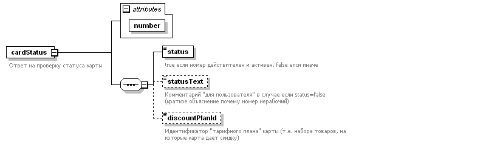

# Метод `cardStatus`

Запрос (проверка) состояния карты/промокода.

## Правила использования

1. Запрос должен выполняться только после ввода номера карты/промокода пользователем в корзину, а ответ сервера действителен только для этой корзины. Запрещается "заранее" запрашивать статусы карт/промокодов "по списку", запрещается "запоминать" ответ сервера и использовать его для последующих корзин.
2. Настоятельно рекомендуется повторно проверять статус карты/промокода в момент финального оформления заказа (чтобы избежать одновременного оформления двух разных заказов с двух разных компьютеров с одним и тем же номером карты/промокода).
3. При положительном ответе сервера о статусе карты/промокода необходимо проверять значение поля `discountPlanId` в ответе сервера, так как в нём содержится информация к каким именно дисконтным условиям относится данная карта/промокод (так как одновременно могут существовать разные диапазоны номеров - на разные препараты, или с разными размерами скидки). \
   Эталонные значения для этого поля согласовываются заранее перед запуском каждой новой дисконтной программы.


## Запрос

В запросе указывается номер карты/промокода.

### XML


```xml
<?xml version="1.0" encoding="UTF-8"?>
<cardStatusRequest
    number="1234567890"
    xmlns="http://www.olekstra.ru/schema/oksana" />
```

### JSON

```json
{
  "number": "1234567890"
}
```


## Ответ

Значения поля `number` то же, что и в запросе.

Поле `status` содержит результат проверки карты/промокода: при значении `true` разрешено предоставление скидки, а при значении `false` предоставление скидки запрещено.

Поле `statusText` присутствует/заполняется только в случае **отрицательного** результата (`status=false`) и содержит текст для пользователя, объясняющий проблему с картой/промокодом - его можно вывести на экран, если для этого предусмотрено соответствующее место.

Поле `discountPlanId` присутствует/заполняется только в случае **положительного** результата (`status=true`) и содержит идентификатор дисконтных условий, связанных с данной картой/промокодом.


### XML



```xml
<?xml version="1.0" encoding="UTF-8"?>
<cardStatus
  number="1234567890"
  xmlns="http://www.olekstra.ru/schema/oksana">
	<status>true</status>
	<statusText>Данный купон уже был использован.</statusText>
	<discountPlanId>SPECIAL5</discountPlanId>
</cardStatus>
```


### JSON

```json
{
  "number": "1234567890",
  "status": true,
  "statusText": "Данный купон уже был использован.",
  "discountPlanId": "SPECIAL5"
}
```

