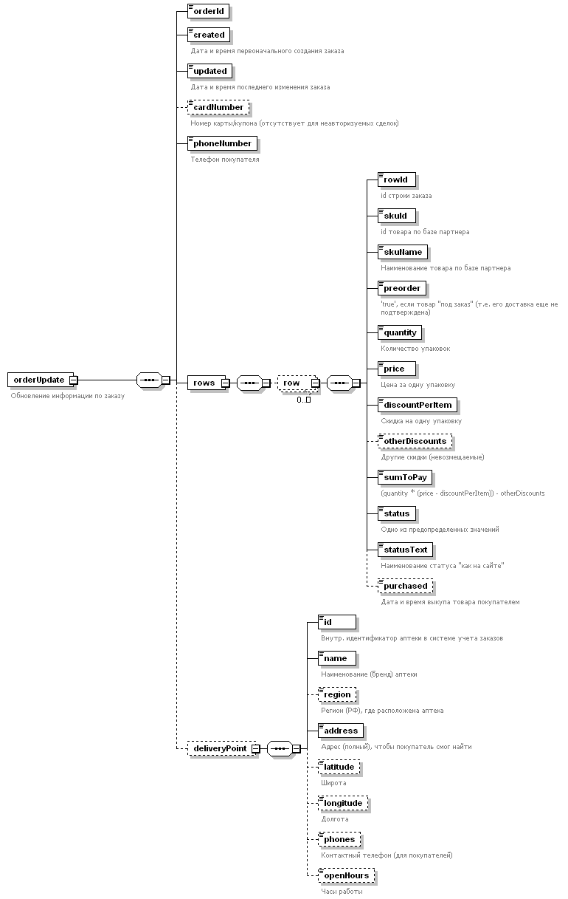

# Метод `orderUpdate`

Обновление статуса заказа.

## Правила использования

1. Заказ всегда обновляется целиком (по `orderId`), даже если изменились данные всего по одной строке;
2. Заказ может содержать 0 строк (т.е. все строки были удалены);
3. После перехода строки в `status == purchased` должна быть указана дата и время выкупа (отдельное поле`purchased`), а также не может впоследствии быть никаких изменений по данной строке.
4. Поля даты/времени должны содержать информацию о часовом поясе. Можно указывать фактический часовой пояс (1997-07-16T19:20:30.45+03:00), или преобразовывать значение в UTC (1997-07-16T16:20:30.45Z) - но это обязательно должна быть правильная точка на оси времени.
5. Сервер проверяет синтаксическую правильность запроса (обязательность и типы значений полей, согласованность сумм между собой), в случае ошибки возвращается ответ с HTTP Status Code отличным от 200 (обычно 400-499).
6. Сервер **не** проверяет бизнес-условия предоставленной заказом скидки (лимиты, количества, суммы и т.п.), так как заказ уже создан в системе бронирования и какие-либо изменения в количествах и суммах делать поздно. В случае нарушений бизнес-требований данный заказ будет исключен из отчетности/возмещения в конец периода.


## Про статусы

Так как в каждой конкретной системе бронирования может быть предусмотрен свой набор статусов (соответствующий имеющимся процессам и технологиям) то одновременно используется два разных поля: `status` и `statusText`.

В поле `status` указывается одно из предопределенных значений, наиболее близкое по смыслу к состоянию в системе бронирования:
  * `processing` - заказ обрабатывается и ещё не подтверждён;
  * `preparing` - заказ подтверждён, собирается или находится "в пути" до точки выкупа;
  * `ready` - заказ прибыл в аптеку назначения и готов к выкупу покупателем;
  * `purchased` - заказ был выкуплен покупателем, состоялась фискальная продажа. Это финальный статус (дальнейшие движения невозможны);
  * `cancelled` - заказ был аннулирован/отменён (из любого из трех первых статусов), это финальный статус (дальнейшие движения невозможны);

В поле `statusText` указывается текстовое значение статуса "для пользователя" (на ему понятном языке). Рекомендуется указывать здесь статус, который отображается покупателю в его личном кабинете на сайте.


## Запрос

Запрос содержит актуальную информацию о заказе: номер, дату и время, состав (строки) заказа с указанием количеств и сумм, аптеку выкупа.

Поле `cardNumber` указывается, если к корзине был применён номер карты/промокода, относящийся к дисконтной программе.

Поле `row.purchased` заполняется тогда и только тогда, когда `status="purchased"`.

Блок полей `deliveryPoint` может быть не указан в статусах `processing` или `cancelled` (если аптека ещё неизвестна на тот момент), однако обязателен к заполнению во всех остальных статусах.

В поле `deliveryPoint.region` (субъект РФ, в котором находится аптека) заполняется если эта информация имеется "в готовом виде" в БД системы бронирования. В случае отсутствия этого поля наименования региона должно присутствовать в поле `address`.

Для каждой строки заказа сервер проверяет выполнение равенства: \
`(quantity * (price - discountPerItem)) - otherDiscounts == sumToPay` \
В случае невыполнения равенства запрос считается некорректным и не принимается.
 

### XML



```xml
<?xml version="1.0" encoding="UTF-8"?>
<orderUpdate xmlns="http://www.olekstra.ru/schema/oksana">
  <orderId>ABC123</orderId>
  <created>2022-01-02T17:18:19+03:00</created>
  <updated>2022-01-03T17:19:20+02:00</updated>
  <cardNumber>1234567890</cardNumber>
  <phoneNumber>+79001234567</phoneNumber>
  <rows>
    <row>
      <rowId>3ecfe436-d712-4835-97f7-5d768cb29bfd</rowId>
      <skuId>SKU123</skuId>
      <skuName>SKU 123 name</skuName>
      <preorder>true</preorder>
      <quantity>2</quantity>
      <price>123.45</price>
      <discountPerItem>23.45</discountPerItem>
      <sumToPay>200.00</sumToPay>
      <status>purchased</status>
      <statusText>Выкуплен</statusText>
      <purchased>2022-01-04T11:12:13+03:00</purchased>
    </row>
    <row>
      <rowId>18477fd3-5ee2-4d73-8159-c4c9da150ccd</rowId>
      <skuId>SKU123</skuId>
      <skuName>SKU 123 name</skuName>
      <preorder>false</preorder>
      <quantity>2</quantity>
      <price>123.45</price>
      <discountPerItem>23.45</discountPerItem>
      <otherDiscounts>10</otherDiscounts>
      <sumToPay>190.00</sumToPay>
      <status>cancelled</status>
      <statusText>Не выкуплен</statusText>
    </row>
  </rows>
  <deliveryPoint>
    <id>A23</id>
    <name>Аптека 'Ромашка'</name>
    <region>Москва</region>
    <address>Москва, ул. Ленина, дом 1</address>
    <latitude>123.45</latitude>
    <longitude>678.90</longitude>
    <phones>8-800-000-00-00</phones>
    <openHours>Пн-Сб, 8:00-22:00</openHours>
  </deliveryPoint>
</orderUpdate>

```


### JSON


```json
{
  "orderId": "ABC123",
  "created": "2022-01-02T17:18:19+03:00",
  "updated": "2022-01-03T17:19:20+02:00",
  "cardNumber": "1234567890",
  "phoneNumber": "+79001234567",
  "rows": [
    {
      "rowId": "3ecfe436-d712-4835-97f7-5d768cb29bfd",
      "skuId": "SKU123",
      "skuName": "SKU 123 name",
      "preorder": false,
      "quantity": 2,
      "price": 123.45,
      "discountPerItem": 23.45,
      "sumToPay": 200.00,
      "status": "purchased",
      "statusText": "Выкуплен",
      "purchased": "2022-01-04T11:12:13+03:00"
    },
    {
      "rowId": "18477fd3-5ee2-4d73-8159-c4c9da150ccd",
      "skuId": "SKU123",
      "skuName": "SKU 123 name",
      "preorder": false,
      "quantity": 2,
      "price": "123.45,
      "discountPerItem": 23.45,
      "otherDiscounts": 10.00,
      "sumToPay": 190.00,
      "status": "cancelled",
      "statusText": "Не выкуплен"
    }
  ],
  "deliveryPoint": {
    "id": "A23",
    "name": "Аптека 'Ромашка'",
    "region": "Москва",
    "address": "Москва, ул. Ленина, дом 1",
    "latitude": 123.45,
    "longitude": 678.90,
    "phones": "8-800-000-00-00",
    "openHours": "Пн-Сб, 8:00-22:00"
  }
}
```

## Ответ

Поле `status` содержит результат обновления заказа. На данный момент там всегда будет содержаться `true` (условия, при которых может появиться `false`, еще не определены).

Поле `statusText` зарезервировано для будущего использования.


### XML


```xml
<?xml version="1.0" encoding="UTF-8"?>
<orderUpdateResult xmlns="http://www.olekstra.ru/schema/oksana">
  <status>true</status>
</orderUpdateResult>

```


### JSON

```json
{
  "status": true
}

```
